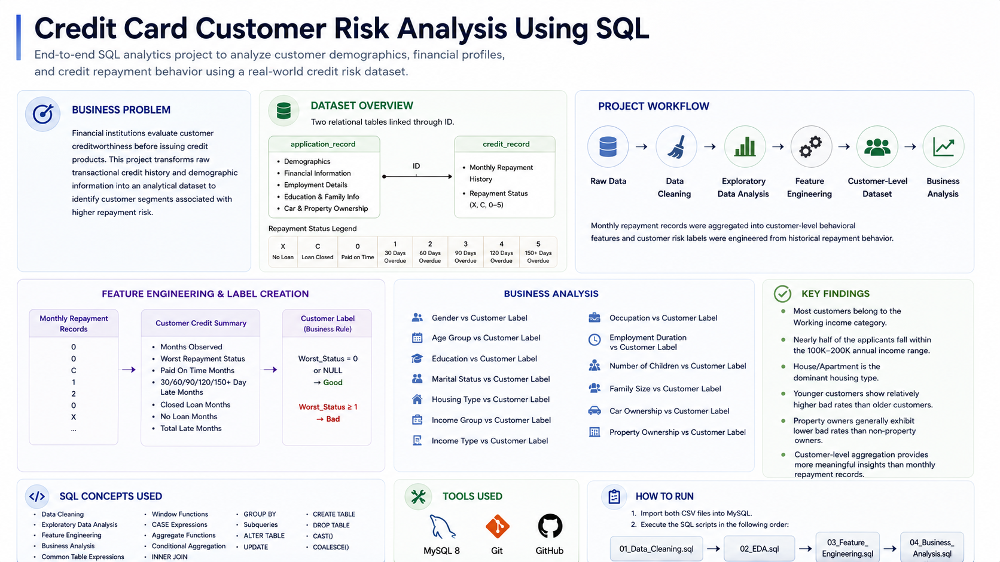

# Credit Card Customer Risk Analysis Using SQL



## Overview

This project demonstrates an end-to-end SQL workflow for analyzing customer credit risk using relational databases. It covers data cleaning, exploratory data analysis (EDA), feature engineering, customer-level dataset construction, and business analysis to identify repayment risk patterns.

The original dataset contains applicant demographic information and monthly credit repayment records. Since the dataset does not provide predefined customer labels, customer risk labels were engineered from historical repayment behavior to enable customer-level risk analysis. :contentReference[oaicite:0]{index=0}

---

## Business Problem

Financial institutions rely on historical customer information and repayment behavior to evaluate creditworthiness before issuing credit products.

This project transforms raw applicant and repayment records into an analytical customer-level dataset and identifies demographic, financial, and behavioral characteristics associated with higher credit risk using SQL.

---

## Project Objectives

- Clean and validate raw customer datasets.
- Perform exploratory data analysis on applicant demographics and repayment history.
- Engineer customer-level behavioral features from monthly repayment records.
- Construct customer risk labels based on repayment history.
- Analyze customer segments associated with higher repayment risk.

---

## Dataset

**Dataset:** Credit Card Approval Prediction

**Source:** https://www.kaggle.com/datasets/rikdifos/credit-card-approval-prediction

The project uses the **Credit Card Approval Prediction** dataset available on Kaggle. It contains two relational tables linked through the **ID** column and is designed for credit risk analysis and machine learning applications. Since the dataset does not provide predefined customer labels, this project constructs customer-level risk labels from historical repayment behavior. :contentReference[oaicite:0]{index=0}

### application_record.csv

Contains applicant demographic and financial information, including:

- Gender
- Age
- Annual Income
- Income Type
- Education Level
- Occupation
- Employment Duration
- Marital Status
- Housing Type
- Number of Children
- Family Size
- Car Ownership
- Property Ownership

### credit_record.csv

Contains monthly customer credit repayment history.

| Status | Description |
|---------|-------------|
| X | No loan during the month |
| C | Loan closed |
| 0 | Paid on time |
| 1 | 30 days overdue |
| 2 | 60 days overdue |
| 3 | 90 days overdue |
| 4 | 120 days overdue |
| 5 | More than 150 days overdue |

---

## Technologies Used

- MySQL 8
- SQL
- Git
- GitHub

---

## Repository Structure

```
Credit-Card-Customer-Risk-Analysis-Using-SQL
│
├── data
│   ├── application_record.csv
│   └── credit_record.csv
│
├── images
│   └── project_overview.png
│
├── sql
│   ├── 01_Data_Cleaning.sql
│   ├── 02_EDA.sql
│   ├── 03_Feature_Engineering.sql
│   └── 04_Business_Analysis.sql
│
├── README.md
└── LICENSE
```

---

## Project Workflow

```
Raw Data
    │
    ▼
Data Cleaning
    │
    ▼
Exploratory Data Analysis
    │
    ▼
Feature Engineering
    │
    ▼
Customer-Level Dataset
    │
    ▼
Business Analysis
```

---

## Phase 1 — Data Cleaning

Data quality checks were performed to ensure consistency before analysis.

Activities included:

- Duplicate validation
- Missing value inspection
- Invalid value detection
- Occupation standardization
- Employment data validation
- General data quality verification

---

## Phase 2 — Exploratory Data Analysis

Exploratory analysis was performed on both applicant demographics and repayment history.

### Applicant Analysis

- Gender Distribution
- Age Distribution
- Annual Income Distribution
- Income Type
- Education Level
- Marital Status
- Housing Type
- Occupation Distribution
- Employment Duration
- Number of Children
- Family Size
- Car Ownership
- Property Ownership

### Credit History Analysis

- Credit Status Distribution
- Customer Repayment Status
- Credit History Length
- Monthly Repayment Behaviour

---

## Phase 3 — Feature Engineering

Monthly repayment records were aggregated into customer-level behavioral features.

Engineered features include:

- Months Observed
- Worst Repayment Status
- Paid-On-Time Months
- 30-Day Late Months
- 60-Day Late Months
- 90-Day Late Months
- 120-Day Late Months
- 150+ Day Late Months
- Closed Loan Months
- No Loan Months
- Total Late Months
- Customer Risk Label

The resulting dataset contains one analytical record per customer.

---

## Phase 4 — Business Analysis

Customer characteristics were analyzed against engineered risk labels to identify higher-risk customer segments.

Business analyses include:

- Gender vs Customer Risk
- Age Group vs Customer Risk
- Education Level vs Customer Risk
- Marital Status vs Customer Risk
- Housing Type vs Customer Risk
- Income Group vs Customer Risk
- Income Type vs Customer Risk
- Occupation vs Customer Risk
- Employment Duration vs Customer Risk
- Number of Children vs Customer Risk
- Family Size vs Customer Risk
- Car Ownership vs Customer Risk
- Property Ownership vs Customer Risk

---

## Key Findings

- Most applicants belong to the **Working** income category.
- Nearly half of the customers fall within the **100K–200K annual income** range.
- House/Apartment is the dominant housing type.
- Younger customers exhibit slightly higher bad rates than older customers.
- Property owners generally show lower bad rates than non-property owners.
- Customer-level aggregation provides more meaningful business insights than analyzing monthly repayment records independently.

---

## SQL Concepts Demonstrated

- Data Cleaning
- Exploratory Data Analysis (EDA)
- Feature Engineering
- Business Analysis
- CASE Expressions
- Aggregate Functions
- INNER JOIN
- GROUP BY
- Subqueries
- CREATE TABLE
- ALTER TABLE
- UPDATE
- COALESCE()

---

## How to Run

1. Import both CSV datasets into MySQL.
2. Execute the SQL scripts in the following order:

```
01_Data_Cleaning.sql

↓

02_EDA.sql

↓

03_Feature_Engineering.sql

↓

04_Business_Analysis.sql
```

---

## Author

**Shubham Tiwari**

GitHub: https://github.com/shubhamtiwari4096
